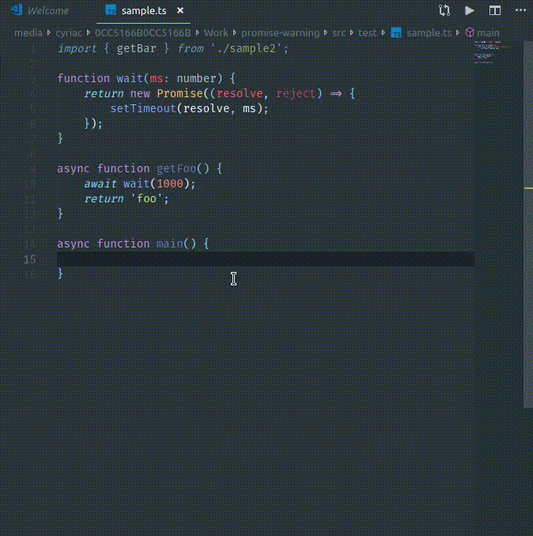

# Promise-Warning

This little extension warns you when you call an asynchronous function without using `await` and yet assigning it's return value.



## Extension Settings

None for now.

## Known Issue

For some reasons, TypeScript doesn't consider this second line as an expression statement;
```ts
let foo;
foo = getFoo(); // No warning will happen here ¯\_(ツ)_/¯
```

## Release Notes

### 0.0.1

Initial release of Promise-Warning
